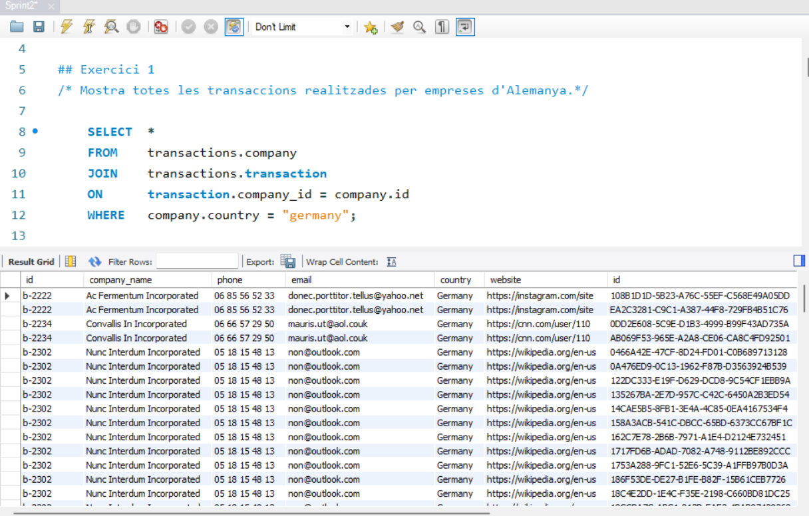

## Exercici 1

Mostra totes les transaccions realitzades per empreses d'Alemanya.

Para resolver este exercici utilizo el siguiente código: 

```sql
SELECT 	*										 
FROM 	transactions.company					 
JOIN 	transactions.transaction                
ON		transaction.company_id = company.id
WHERE	company.country = "germany";			
```

Utilizo la función where para seleccionar solo Alemania
Ese código devuelve 118 filas que contiene información de las empresas que han realizado transacciones de Alemania.



[Output workbench](output_n1e1.md)

## Exercici 2

Màrqueting està preparant alguns informes de tancaments de gestió, et demanen que els passis un llistat de les empreses que han realitzat transaccions per una suma superior a la mitjana de totes les transaccions.

Informe de tancament de gestion: 

1. Obtener el valor de la mediana de todas las transacciones

```sql
SELECT AVG(amount) FROM transactions.transaction;
```

2. Obtener una tabla que indique las empresas con nombre de pais que han hecho transacciones mayores que la media

```sql
SELECT  company.country,
        company.id, 
        transaction.amount
FROM 	transactions.company					# 
JOIN 	transactions.transaction				# 
ON		transaction.company_id = company.id		# 
WHERE	transaction.amount > (SELECT AVG(amount) FROM transactions.transaction);
```

3. Obtener un listado a partir de la tabla anterior de los paises que lo conforman

```sql 
SELECT DISTINCT Country
FROM 
    (SELECT company.Country,
            company.id, 
            transaction.amount
    FROM 	transactions.company					 
    JOIN 	transactions.transaction				 
    ON		transaction.company_id = company.id		 
    WHERE	transaction.amount > 
            (SELECT AVG(amount) FROM transactions.transaction)) AS tb_sq
ORDER BY	Country ASC;
```

En este ultimo caso, utilizo el distinct debido a que se repetin algunas compañias.

## Exercici 3

El departament de comptabilitat va perdre la informació de les transaccions realitzades per una empresa, però no recorden el seu nom, només recorden que el seu nom iniciava amb la lletra c. Com els pots ajudar? Comenta-ho acompanyant-ho de la informació de les transaccions.

1. Lo primero es udentificar aquellas compañias que cumplent esto. En este caso bastarà con un JOIN y un WHERE con el comando LIKE.

```sql 
SELECT *
FROM 	transactions.company					# 
JOIN 	transactions.transaction				# 
ON		transaction.company_id = company.id		# 
WHERE   company.company_name LIKE "c%"; 
```

El comando _**LIKE**_ permite buscar un patrón, que en este caso es que la primera letra comience por "c", que en este caso se escribe: 

```sql 
WHERE   company.company_name LIKE "c%"; 
```

## Exercici 4

Van eliminar del sistema les empreses que no tenen transaccions registrades, lliura el llistat d'aquestes empreses.

Hago una comparacion manual del numero de compañyas en cada tabla:  

```
SELECT DISTINCT company_id	FROM transaction;
SELECT          company_id	FROM transaction;
SELECT          id          FROM company;
```

### Opcion 1

Para ello, deberia tener un tipo de join en el que tenga las emprseas que no tienen transacciones. Puedo usar un left join y buscar valores que sean nulo. 

Es decir, con un left join tendré una tabla con aquellas compañias que estando en la tabla company, en la tabla transacition no estan y por lo mismo, en este join el valor será null

```sql
SELECT 		company.id, 
			transaction.amount
FROM 		transactions.company						
LEFT JOIN	transactions.transaction		 
ON			transaction.company_id = company.id		
WHERE 		transactions.company.id IS NULL;
```

### Opcion 2
Tambien podría utilizar una subquery para realizar la misma consulta

```sql
SELECT	company_id, transaction.amount
FROM	transaction
WHERE	company_id NOT IN (SELECT id FROM company);
```
- El IN sirve para specify multiple possible values for a column, 
- Puedo generar una subquery con los valores de una tabla

En otras palabras, esta parte de la consulta selecciona solo aquellas filas de la tabla _**transaction**_ cuyo _company_id_ no está presente en la columna _id_ de la tabla _**company**_.
