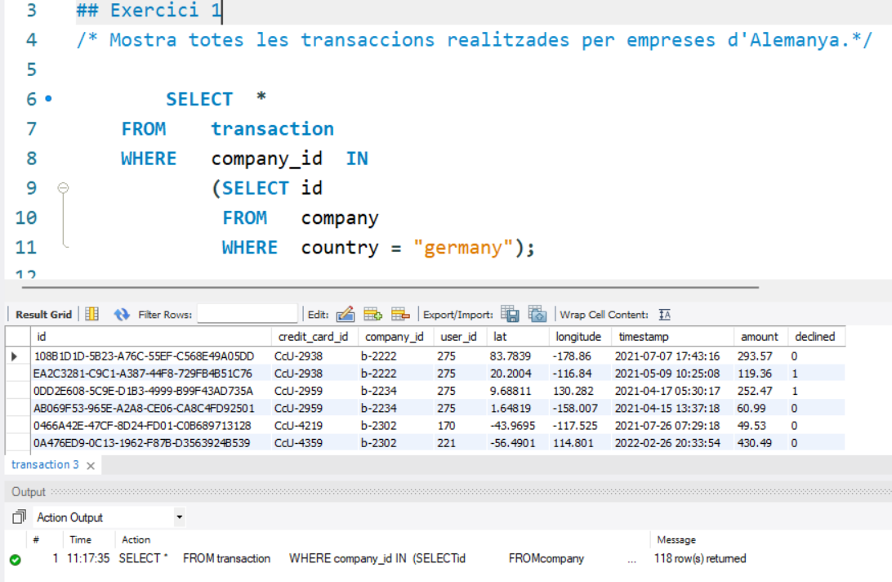
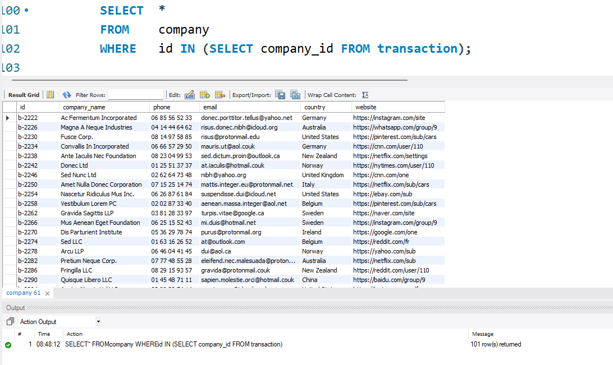
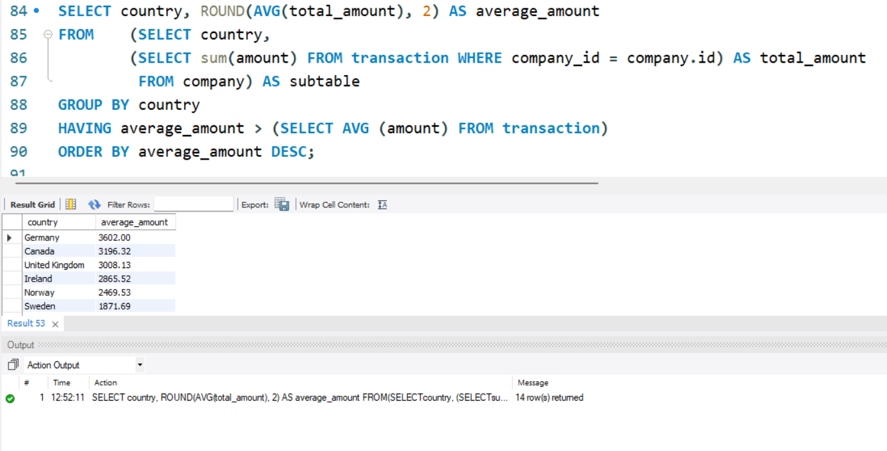
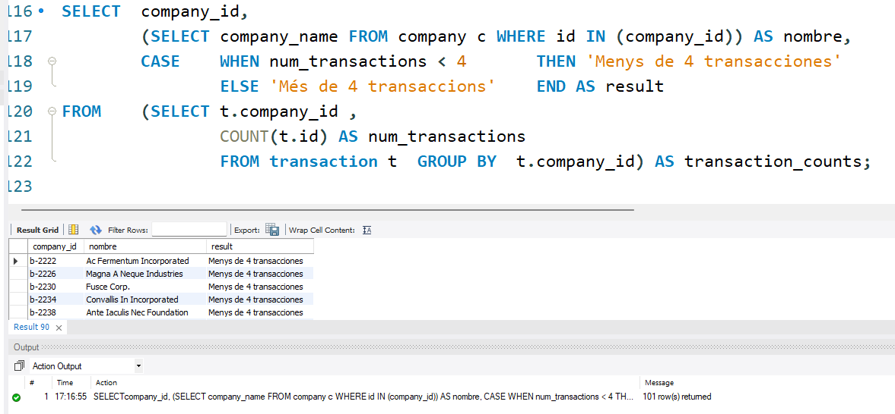

# Sprint 2: Nivel 1

## Exercici 1
Muestra todas las trasacciones realizadas por empresas de alemania

Para resolver este exercici utilizo el siguiente código: 


Utilizo la función WHERE = "germany" para seleccionar solo las empresas de Alemania.




## Exercici 2

Marketing solicita un listado de empresas que hayan realizado transacciones por encima del promedio de todas las transacciones para informes de cierre de gestión.

**Paso 1**: Obtener el valor de la media de todas las transacciones


**Paso 2**: Obtener una tabla que indique las empresas que han hecho transacciones mayores que la media


Utilizo las funciones AVG() y DISTINCT para calcular la media de las transacciones y obtener una lista única de países respectivamente.

Finalmente el output total es el siguiente:


## Exercici 3

El departament de comptabilitat va perdre la informació de les transaccions realitzades per una empresa, però no recorden el seu nom, només recorden que el seu nom iniciava amb la lletra c. Com els pots ajudar? Comenta-ho acompanyant-ho de la informació de les transaccions.

1. Lo primero es identificar aquellas compañias que cumplen con la condicion de comenzar con la letra "c". 		
   
	En este caso bastará con un JOIN y un WHERE con el comando LIKE.


- El comando _**LIKE**_ permite buscar un patrón, que en este caso es que la primera letra comience por "c".

El resultado completo es el siguiente: 


## Exercici 4

Van eliminar del sistema les empreses que no tenen transaccions registrades, lliura el llistat d'aquestes empreses.

### Opcion 1

Para ello, deberia tener un tipo de join en el que tenga las emprseas que no tienen transacciones. Puedo usar un left join y buscar valores que sean nulo. 

Es decir, con un left join tendré una tabla con aquellas compañias que estando en la tabla company, en la tabla transacition no estan y por lo mismo, en este join el valor será null


### Opcion 2
Tambien podría utilizar una subquery para realizar la misma consulta

- El _IN_ sirve para specify multiple possible values for a column, 
- Puedo generar una subquery con los valores de una tabla

En otras palabras, esta parte de la consulta selecciona solo aquellas filas de la tabla _**transaction**_ cuyo _company_id_ no está presente en la columna _id_ de la tabla _**company**_.


En ambos casos el resultado es null o vacio.


# Sprint 2- Nivel 2
## Exercici 1




- En este caso, para seleccionar las columnas de transaction, podemos utilizar el comando ```transaction.*```
- Con la subquery tenemos como resultado el pais de la empresa indicada en el enunciado. 

## Exercici 2


# Sprint 2 - Nivell 3
## Exercici 1
S'estan establint els objectius de l'empresa per al següent trimestre, per la qual cosa necessiten una base sòlida per a avaluar el rendiment i mesurar l'èxit en els diferents mercats. Per a això, necessiten el llistat dels països la mitjana de transaccions dels quals sigui superior a la mitjana general.


## Exercici 2
El Departament de recursos humans vol un llistat de les empreses on especifiquis si tenen més de 4 transaccions o menys.

Que debo tener?



- En este caso tengo una tabla en la que creo una columna llamada "result" en la que indico si tiene "Mes de 4 trasnacciones" o "menys de 4 trasnacciones"
- Para ello, utilizo un comando CASE que permite establecer una condicion. 
